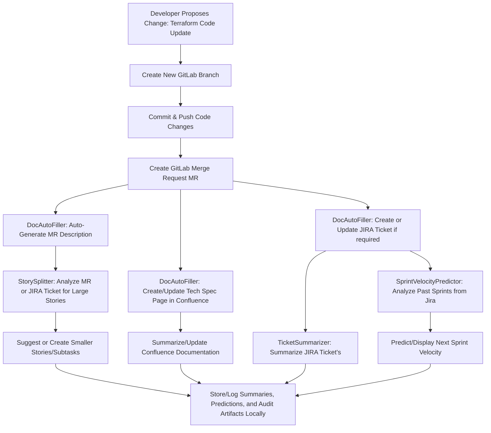

# AutoDocFiller Project

## Project Overview
AutoDocFiller is an automated documentation and Agile workflow management system that integrates GitLab, Jira, and Confluence to streamline infrastructure change processes and team collaboration. It leverages AI (via OpenAI-powered LLMs) to generate clear, context-aware documentation, ticket summaries, tech specs, sprint velocity predictions, and story splitting suggestions.

This solution reduces manual effort while ensuring consistent, accurate, and traceable documentation coverage throughout the development lifecycle.

## Key Features
- 🔄 **Automated Workflow Integration**: Seamlessly connects GitLab, JIRA, and Confluence APIs for data synchronization and ticket management.
- 🤖 **AI-Powered Documentation**: Uses large language models to auto-generate pull request (MR) descriptions and technical documentation.
- 📝 **Smart Ticket Management**: Automatically generates concise Jira ticket summaries for better Agile ceremonies.
- 📊 **Sprint Velocity Prediction**: Employs machine learning methods to predict future sprint capacity using historical Jira sprint data.
- ✂️ **Story Splitting Assistance**: Suggests splitting large Agile stories into smaller manageable tasks.
- 💾 **Local Storage & Audit**: Stores generated summaries, specs, and reports locally for traceability and historical analysis.


## High-Level Workflow


## Components
1. **GitLab Integration**
   - Manages code changes
   - Creates branches and merge requests
   - Tracks infrastructure modifications

2. **JIRA Integration**
   - Creates and updates tickets
   - Tracks work progress
   - Generates AI-powered summaries

3. **Confluence Integration**
   - Stores technical specifications
   - Maintains documentation history
   - Ensures knowledge persistence

4. **Local Storage System**
   - Maintains JSON and TXT formats
   - Organizes by category (JIRA, Confluence, Merge Requests)
   - Provides easy access to historical data

## Project Structure
```
AutoDocumentFiller/
├── agents/                          # AI Agents for content generation and Agile automation
│   ├── doc_autofiller_agent.py     # Main documentation generation agent
│   ├── ticket_summarizer_agent.py  # Jira ticket summarization agent
│   ├── sprint_velocity_predictor.py # Sprint velocity forecasting agent
│   └── story_splitter.py           # Agile story splitting agent
├── apis/                           # API clients for external integrations
│   ├── gitlab_client.py            # GitLab API integration
│   ├── jira_client.py              # Jira API integration
│   ├── confluence_client.py        # Confluence API integration
│   └── summary_storage.py          # Local storage management for summaries and docs
├── Prompts/                        # AI prompt templates for all agents
│   ├── templates.txt               # DocAutoFiller general prompt templates
│   ├── ticket_summary_prompt.txt  # Ticket summarization prompt
│   └── tickets.txt                 # Additional ticket related prompts or templates
├── specs/                         # Specification document templates
│   └── spec_template.txt          # Technical specification template
├── summaries/                     # Local storage for generated summaries & docs
│   ├── jira/                      # Jira ticket summaries storage
│   ├── confluence/                # Confluence spec documents storage
│   └── merge_requests/            # Merge Request descriptions storage
├── tickets/                       # Ticket management related text/templates
│   └── tickets_template.txt       # Ticket template examples
├── tests/                        # Unit and integration tests
│   └── test_doc_autofiller.py    # Tests for DocAutoFiller agent logic
├── analysis_outputs/              # Outputs for velocity prediction or analytics
│   └── (generated analysis JSON and logs)
├── terraform/                    # Infrastructure-as-code (Terraform) files
│   └── main.tf                   # Sample terraform configuration
├── main.py                      # Primary orchestrator of the entire workflow
└── test_velocity_prediction.py   # Standalone test file for velocity predictor agent
```

## Getting Started
## Set up environment variables:
   ```bash
   JIRA_URL=https://your-domain.atlassian.net
   JIRA_USER=your-email
   JIRA_TOKEN=your-token
   GITLAB_URL=your-gitlab-url
   GITLAB_TOKEN=your-token
   GITLAB_PROJECT_ID=your-project-id
   CONFLUENCE_URL=https://your-domain.atlassian.net/wiki
   CONFLUENCE_USER=your-email
   CONFLUENCE_TOKEN=your-token
   CONFLUENCE_SPACE=your-space
   OPENAI_API_KEY=your-openai-api-key
   ```

**Note:**
   Replace all placeholders with your real tokens and keys.
   Do not commit .env to public repositories (add .env to .gitignore).

## Getting Started:
1. Prepare Python Environment:
   ```bash
   python -m venv venv
   source venv/bin/activate     # macOS/Linux

   venv\Scripts\activate.bat   # Windows PowerShell
   ```
2. Install dependencies using pip:
   ```bash
   pip3 install -r requirements.txt
   pip3 install -U langchain-openai jira scikit-learn
   ```
3. Run the workflow:
   ```bash
   python3 main.py
   ```
## This script will:

 - Create a feature GitLab branch and commit terraform changes.

 - Auto-generate an MR description using DocAutoFiller.

 - Create or update Jira tickets and generate summaries.

 - Predict sprint velocity based on Jira historical sprint data.

 - Suggest splitting large stories using StorySplitter.

 - Create or update technical specification pages in Confluence.

 - Locally store all generated content for audit and traceability.

4. Run Unit Tests (Optional):
   ```bash
   pytest tests/test_doc_autofiller.py
   ```
5. Velocity Prediction Test (Optional):
   ```bash
   python3 test_velocity_prediction.py
   ```

## How each agent works:
- **DocAutoFiller**: Generates human-readable MR descriptions and creates/updates Confluence specs
- **TicketSummarizer**: Fetches and summarizes Jira tickets into concise updates for Agile meetings
- **StorySplitter**: Inspects and proposes splitting large Jira stories into smaller actionable tasks
- **SprintVelocityPredictor**: Predicts upcoming sprint velocity via ML regression on historical Jira sprint data

