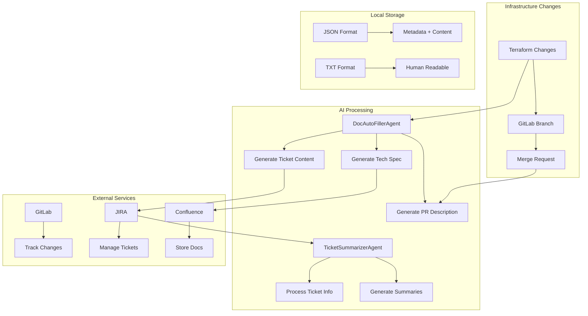
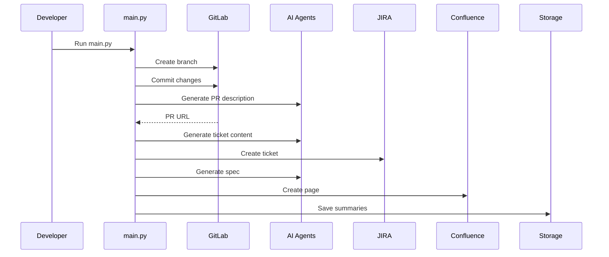
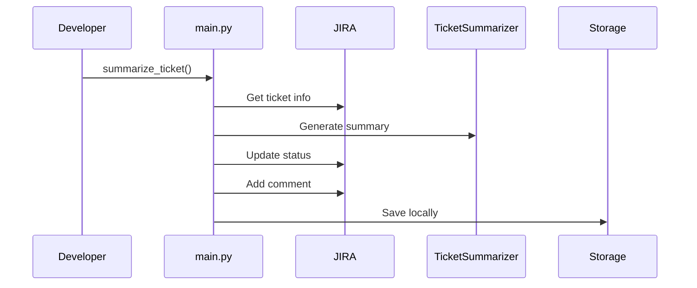

# AutoDocFiller Technical Documentation

## System Architecture

### 1. Components Workflow


## Detailed Component Breakdown

### 1. AI Agents

#### DocAutoFillerAgent (`agents/doc_autofiller_agent.py`)
- **Purpose**: Generates human-readable documentation from technical changes
- **Functions**:
  ```python
  generate_pr_description(context) -> str
  generate_tickets(title, context, pr_url) -> str
  generate_spec(reason, diff, pr_url) -> str
  ```
- **AI Model**: Perplexity AI
- **Use Cases**: PR descriptions, ticket content, technical specifications

#### TicketSummarizerAgent (`agents/ticket_summarizer_agent.py`)
- **Purpose**: Creates concise summaries of JIRA tickets
- **Functions**:
  ```python
  summarize_ticket(ticket_details) -> str
  ```
- **Input Processing**: Processes title, description, status, comments
- **Output**: Standup-friendly summaries

### 2. API Clients

#### JiraClient (`apis/jira_client.py`)
```python
class JiraClient:
    def create_ticket(project_key, summary, description)
    def update_ticket_status(ticket_id, status)
    def add_comment(ticket_id, comment)
    def get_ticket_info(ticket_id)
```

#### GitLabClient (`apis/gitlab_client.py`)
```python
class GitLabClient:
    def create_branch(project_id, branch_name)
    def commit_file(project_id, branch, path, content, message)
    def create_merge_request(project_id, branch, description, title)
```

#### ConfluenceClient (`apis/confluence_client.py`)
```python
class ConfluenceClient:
    def create_page(space, title, body)
    def update_page(page_id, title, body)
```

### 3. Storage System (`apis/summary_storage.py`)
```python
class SummaryStorage:
    def save_jira_summary(ticket_id, content)
    def save_confluence_summary(page_title, content)
    def save_merge_request_summary(mr_id, content)
```

## Process Flows

### 1. New Infrastructure Change


### 2. Ticket Status Update


## File Organization
```
AutoDocumentFiller/
├── agents/
│   ├── doc_autofiller_agent.py     # Main documentation generator
│   └── ticket_summarizer_agent.py  # Ticket summary generator
├── apis/
│   ├── gitlab_client.py            # GitLab API integration
│   ├── jira_client.py             # JIRA API integration
│   ├── confluence_client.py       # Confluence API integration
│   └── summary_storage.py         # Local storage management
├── Prompts/
│   ├── templates.txt              # AI prompt templates
│   └── ticket_summary_prompt.txt  # Ticket summary templates
├── specs/
│   └── spec_template.txt         # Technical spec templates
├── summaries/                    # Local storage directory
│   ├── jira/                    # JIRA summaries
│   ├── confluence/              # Confluence docs
│   └── merge_requests/          # MR descriptions
└── terraform/                   # Infrastructure code
```

## Configuration

### Environment Variables
```bash
# JIRA Configuration
JIRA_URL=https://your-domain.atlassian.net
JIRA_USER=your-email
JIRA_TOKEN=your-token

# GitLab Configuration
GITLAB_URL=your-gitlab-url
GITLAB_TOKEN=your-token
GITLAB_PROJECT_ID=your-project-id

# Confluence Configuration
CONFLUENCE_SPACE=your-space
CONFLUENCE_USER=your-user
CONFLUENCE_TOKEN=your-token
```

## Usage Examples

### 1. Create New Infrastructure Change
```python
python main.py
```
This will:
- Create GitLab branch and merge request
- Generate and create JIRA ticket
- Create Confluence specification
- Store all summaries locally

### 2. Update Ticket Status
```python
from main import summarize_ticket
summarize_ticket("SMP-7", new_status="In Progress")
```

### 3. Generate Summary Only
```python
from main import summarize_ticket
summarize_ticket("SMP-7")
```

## Performance Considerations
- AI response time: 2-5 seconds per generation
- Local storage: JSON for structure, TXT for readability
- Parallel processing where possible
- API rate limits respected

## Security
- All API tokens stored in environment variables
- Local summaries for backup and audit
- No sensitive data in generated content
- API access through secure HTTPS

## Maintenance
- Regular token rotation recommended
- Monitor AI API usage
- Backup local summaries periodically
- Update AI prompts as needed

## Error Handling
- Graceful degradation if services unavailable
- Local storage as backup
- Detailed error logging
- Retry mechanisms for API calls
